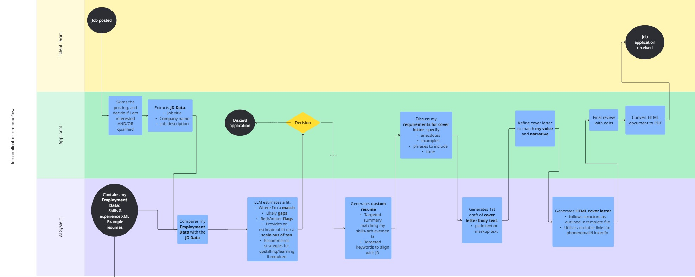

# Targeting Job Applications with LLMs (MVP)

I’m building a lightweight workflow to generate **targeted resumes and cover letters** from a single source of truth (XML + HTML templates with Internal CSS). I keep content in GitHub so I can version changes, print to PDF with clickable links, and interact directly with my custom GPT.

## Why I’m doing this

Tailoring applications takes time, different roles need different emphasis/keywords, and squeezing everything into one page is hard. This MVP helps me assemble truthful, role-specific materials faster.

## How I use it (end-to-end)

1. **Collect the JD** (title, company, key requirements).
2. **Compare JD ↔ my employment data** and let the LLM estimate fit (green/amber/red) and call out missing skills.
3. **Generate first drafts**: a one-page resume variant and a cover-letter body (plain text/markup).
4. **Human pass**: I review, rewrite, and decide what to keep—nothing ships without my edits.
5. **Export**: I use the HTML templates and print to PDF so links stay clickable.

> I originally kept work history in JSON but moved to **XML** because it’s easier for me to edit and more explicit for LLMs to parse.

## What’s here (MVP snapshot)

- Structured **work history** and **skills** (XML).
- **HTML resume** and **HTML cover-letter** templates I can quickly tailor and export to PDF.

*(The repo is a work-in-progress; files and structure will evolve.)*

## Process Flow

[Process flow on Miro](https://miro.com/app/board/uXjVJGAOjGw=/?share_link_id=19281139838)

## Guardrails & ethics (human-in-the-loop)
- I keep myself **in the loop at every stage.** I always review, rewrite, and fact-check so the output reflects my voice and thinking. No automated slop for recruiters.
- I never invent achievements or inflate scope; content must be grounded in my source data and real work.
- PDFs are exported from HTML so readers get clean layout and clickable links without gimmicks.

## Notes

- This MVP follows my process flow: fit assessment, gap spotting, drafting, and final review/export.
- I drew on prior ATS experience to keep outputs competitive yet honest.
